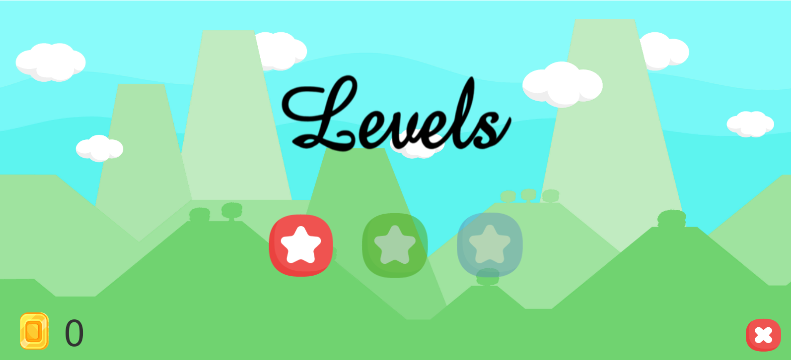
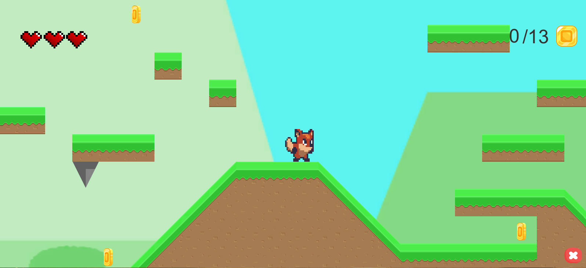
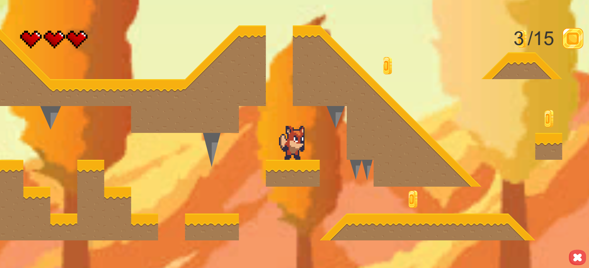
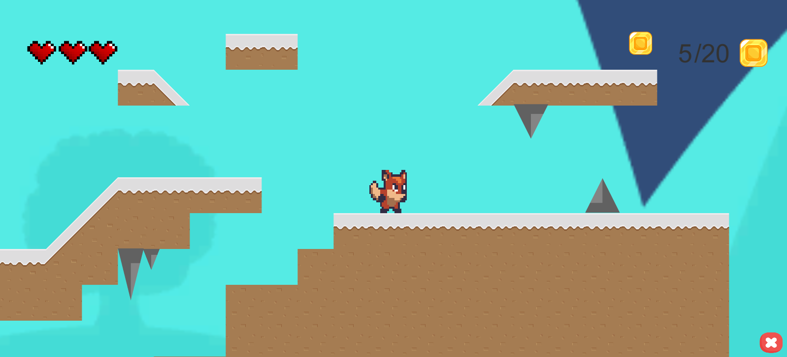

# FoxGame - Unity 2D Game
In order to play the game, just download FoxGame folder and run FoxGame.exe file. 
Below you can read some instructions and see the scenes photos...
## Instructions:
There are 3 levels - from the easiest to the most difficult. You must complete the previous level to play the next one. In each level you can score different number of coins. To finish level, just get 10 of them and find the chest. Watch out for the spikes, because you only have 3 lives. Good luck!
## Game scenes:





## Authors:
```
Mateusz Balcer
Szymon Betlewski
Mateusz Kucaj
```
